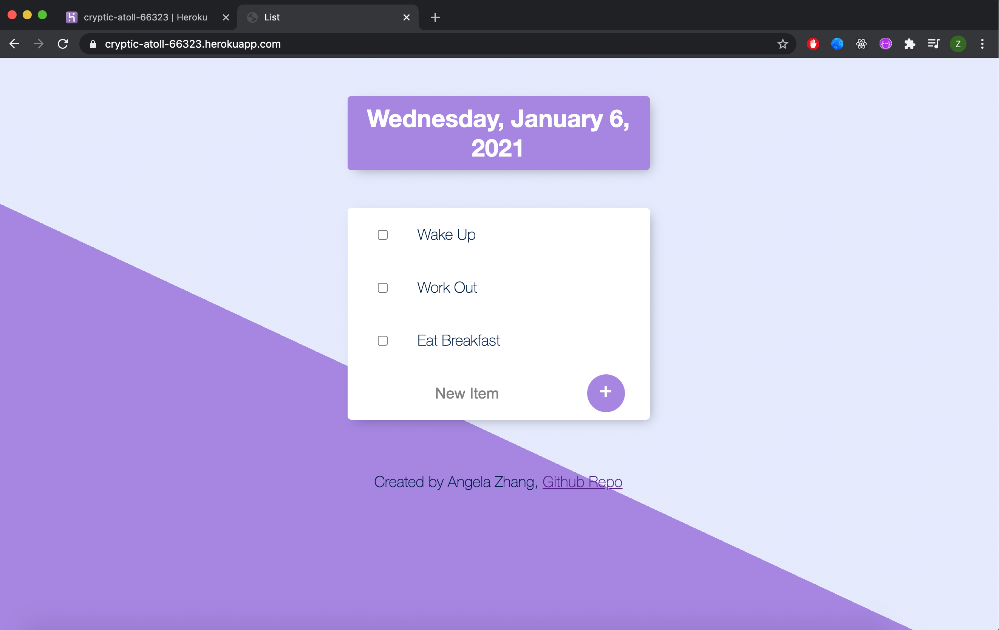

# to-do-list
a to-do list fullstack web app deployed on Heroku with MongoDB cloud
author: Angela Zhang

## installation & use
The best way is to access the deployed website via https://cryptic-atoll-66323.herokuapp.com/.

If you would like to download the repo and run the app locally on localhost 3000 (or any port you specify), that is also an option.

## tools, libraries used & why I chose to use it
The following table shows my rationale behind building this app, and why I chose to use the frameworks and tools that I did.

<table>
  <tbody>
    <tr>
        <th>Tool</th>
        <th>Why I chose it</th>
    </tr>
    <tr>
        <td>Node.js</td>
        <td>
            <ul>
                <li>popular and well-documented</li>
                <li>uses JS as main application</li>
                <li>robust framework</li>
            </ul>
        </td>
    </tr>
    <tr>
      <td>Express.js</td>
      <td>makes it easier to handle http requests</td>
    </tr>
    <tr>
      <td>MongoDB cloud</td>
      <td>
        <ul>
          <li>noSQL DBs like MongoDB are easier to scale</li>
          <li>not much inter-document relationships need to be made for the purposes of this app</li>
          <li>well-documented</li>
          <li>free cloud database</li>
        </ul>
      </td>
    </tr>
    <tr>
      <td>Heroku</td>
      <td>handles a lot of server-side stuff for me and gets rid of a *lot* of headaches</td>
    </tr>
    <tr>
      <td>body-parser</td>
      <td>helps with requests from client-side e.g. add item, delete item</td>
    </tr>
    <tr>
      <td>dotenv</td>
      <td>login security</td>
    </tr>
    <tr>
      <td>ejs</td>
      <td>saves a lot of lines of code, especially given that I need to rewrite the same code so many times when creating new to-do lists</td>
    </tr>
    <tr>
      <td>lodash</td>
      <td>makes string formatting a lot easier</td>
    </tr>
  </tbody>
</table>

## functionality
By default, when you come to the page, you are welcomed to the home page, or default to-do list. Its title is the date of the day you access the page. It is prepopulated with 3 to-do items, as you can see below:

Note: because all users of the web app can come in and modify the to-do lists as they wish, the items on the to-do list may look very different from what I have above or in examples below.

### adding items to a list
You can add items to a to-do list by simply inputing the new item name into the last box, and then pressing the "+" or the enter key, like so:

### deleting items from a list
You can delete items to a to-do list by simply clicking the box next to the item name, like so:

### creating new lists
New to-do lists are created when a new parameter name for a list is inputed into the URL. For example, in the gif below, I created a new list called "new-list":

On the backend, a new to-do list collection is created in the database. For reference, this is an illustration of the structure of the database:

As such, you can navigate back to the page later and find the items still there. Any changes you make will be made forever.

Note also that the same adding and deleting items functionality works for these new lists as well.

## references
Special thanks to the following resources / tutorials for making this project possible:
* [MongoDB's Atlas Cluster Tutorial](https://www.youtube.com/watch?v=rPqRyYJmx2g&ab_channel=MongoDB)
* [The Coding Train Tutorial on dotenv](https://www.youtube.com/watch?v=17UVejOw3zA&t=72s&ab_channel=TheCodingTrain)
* [Node.js Gitignore File Template](https://github.com/github/gitignore/blob/master/Node.gitignore)
* Udemy Fullstack Course by Angela Yu